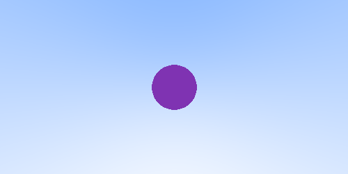
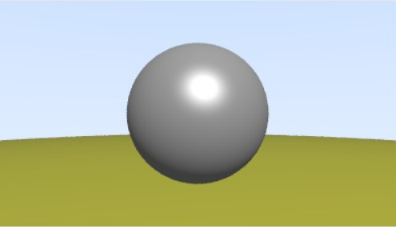
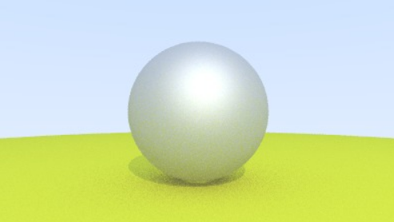

# RayTracingToy
Pràctica 1 - GiVD 2023-24

En aquest fitxer cal que feu l'informe de la pràctica 1.

## Equip:
**B02**
* Eshaan Mittal
* Adria Gasull Rectoret
* Daniel Gonzalez Braza
* Paula Bezares Cano

### Features (marqueu les que heu fet i qui les ha fet)
- Tutorial 0
    - [x] Background amb degradat
      - Eshaan Mittal
    - [x] Color Shading
      - Eshaan Mittal
    - [x] Normal Shading
      - Eshaan Mittal
    - [x] Creació d'una escena procedimentalment
      - Eshaan Mittal
    - [x] Creació d'una escena via fitxer json
      - Eshaan Mittal
 - Tutorial 1
   - [x] Intersecció amb l'escena
      -  Paula Bezares, Eshaan Mittal
   - [x] Creació de nous objectes i interseccions (VIRTUALWORLD) 
        - [x] Hit Box
          - EAdria Gasull, Daniel Gonzalez
        - [x] Hit Triangle
          - Eshaan Mittal, Daniel Gonzalez, Adria Gasull
        - [x] Hit Malla
          - Eshaan Mittal, Paula Bezares
   - [x] Exploració del Raig via multiples hits
     - Eshaan Mittal
   - [x] Ray Marching
     - Eshaan Mittal
       
- Tutorial 2
  - [x] Shadings bàsics
    - Paula Bezares
  - [x] Ombres
    - Eshaan Mittal, Paula Bezares
  - [x] Penombres amb llums amb volum
    -  Eshaan Mittal
  - [x] Ambient occlusion
    - Eshaan Mittal, Paula Bezares

- Tutorial 3
  - [x] Reflexions 
    - Eshaan Mittal, Paula Bezares
  - [x] Transparències
    - Eshaan Mittal, Paula Bezares
  - [x] Visualitzar els Bounding Volumes
    - Eshaan Mittal
  - [x] Environmental mapping
    - Eshaan Mittal

- [ ] Opcionals
- [ ] Preparació de l'escena final
- [ ] Evaluació de l'eficiència de les optimitzacions en diferents escenes

### Explicació de la pràctica    
  * **Organització de la pràctica**
    * Hemos organizado la practica haciendo los apartados que podiamos en el momento que nos poniamos. Muchas veces trabajabamos juntos con el mismo ordenador para que todos los que estaban veian lo que estabamos haciendo.
  
  * **Decisions a destacar**
    * Comenteu les decisions que heu pres 
### Screenshots de cada fase
Los imagenes no salen bien en el pdf del readme. Se tendran que ver en github.
* **Tutorial 0**:
  
      · Degradat:
    

        </img>
    

  
      · Esfera unitaria:
    

        </img>
    

  
      · Esfera amb Normal Shading
    

        </img>
    

      · Escena amb esferes
    

        </img>
    

* **Tutorial 1**:
  
      · Escena amb diferents objectes
    

        </img>
    

      · AllHits oneEsphere
    

        </img>
        </img>
        </img>
        </img>
    

      · AllHits twoSpheres
    

        </img>
    

      · Box
    

        </img>
    

  
      · Triangle
    

        </img>
    

      · Mesh
    

        </img>
    

      · Acceleracions
    

        </img>
        </img>
    

* **Tutorial 2**:
  
        · Component ambient
    

        </img>
    

      · Component Difosa
    

        </img>
    

  
      · Component Especular
    

        </img>
    

      · Combinació de les 3 components
    

        </img>
    

      · Atenua en profunditat
    

        </img>
    

    
      · Llum global
    

        </img>
    

      · Shadows with Color Shading
    

        </img>
    

      · Shadows with Normal Shading
    

        </img>
    

      · Shadows with Cel/Toon Shading
    

        </img>
    

* **Tutorial 3**:
  
      · Lambertian Sphere with Max Depth 10
    

        </img>
    

  
      · Reflexions Metàliques with Max Depth 10
    

        </img>
    

      · Esferes de metall transparents with Max Depth 3
    

        </img>
    

      · Transparències 4 esferes with Max Depth 4
    

        </img>
    

    
      · Procedurally Generated Scene
    

        </img>
    

      · Our Json Scene (escenaPrueba.json and setupRenderEscenaPrueba.json)
    

        </img>
    

    Nuestra escena base que aun no esta acabado. Son dos cubos de metal uno de material definido como Chrome y el otro como Gold, reflejando el otro.

      · Comparison of Blinn-Phong Transparent(Left) and All Hits Transparent(Right)
    

        </img>
        </img>
    

    A la izquierda, se emplea el modelo de sombreado Blinn-Phong, que produce reflejos especulares más nítidos y reflejos más claros, ofreciendo un acabado pulido y brillante a los objetos transparentes. Este efecto se logra utilizando el vector intermedio entre la vista y las direcciones de la luz para un cálculo eficiente de la reflexión especular. A la derecha, se utiliza un método más simple, que calcula múltiples intersecciones de los rayos de luz a través de materiales transparentes, solo considerando los componentes kt y Kd del material. Además, no consideramos ningún reflejo o refracción de los rayos de luz, es decir, viajan en línea recta, lo que lo convierte en una forma más rápida de representar una imagen. 

* **Opcionals**:

* **Més visualitzacions**:

   * Per totes les imatges, incluiu aqui la imatge obtinguda i els fitxers de dades 
   i de configuració que heu fet servir
